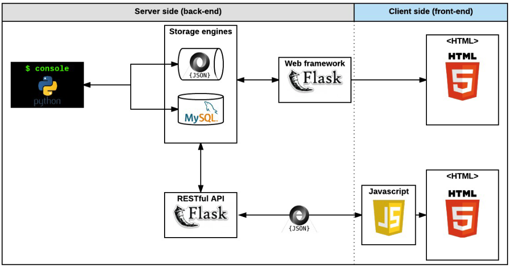

<h1 align="center">AirBnB_Clone</h1>

 

# Creating A Console for AirBnB Project [ALX-High-level-language-Project]

## Description :house:

The AirBnB clone is the initial stage towards creating a complete web application.
To manipulate data, it entails building a terminal to communicate with the storage engine (JSON files and SQL).
Python cmd module was implemented for this.

`Actions allowable: Create, Show, Destroy, All, and Update of data on the DB.`
